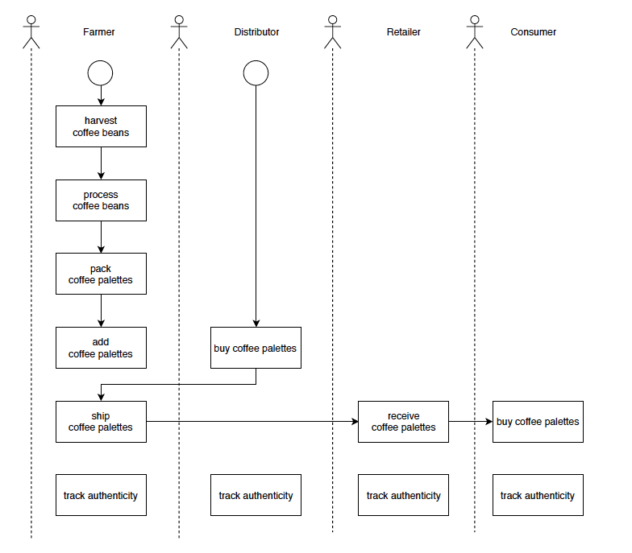
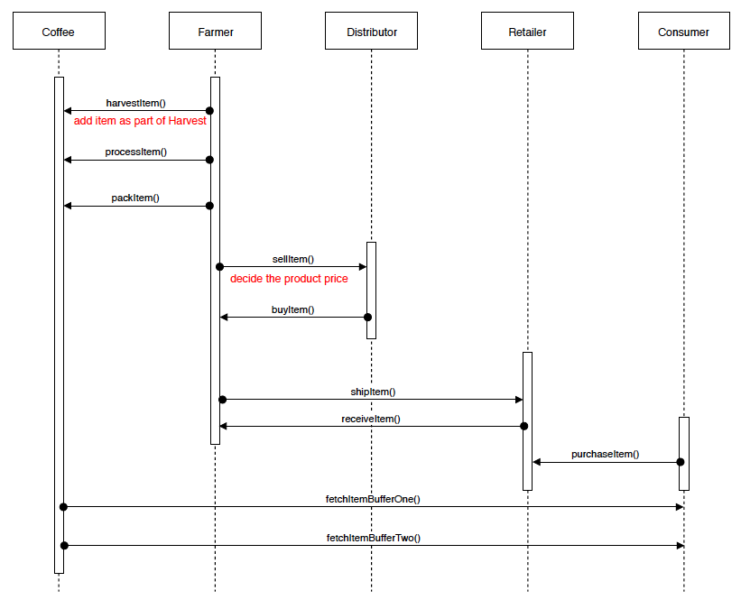
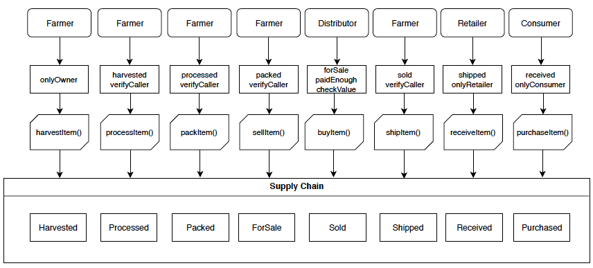
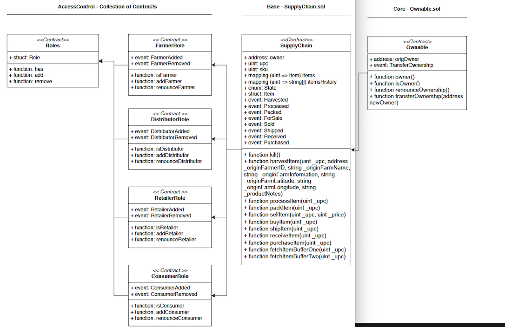

# Blockchain Developer Nanodegree project3 (Daap supplychain)
By the completion of Project 2, you’ll have learned the importance of Proof of Existence, which is used to verify whether a digital asset is authentic and can be trusted. In this project, you’ll scale up to architect a solution that verifies authenticity for a product when multiple actors are involved. You’ll build a supply chain system on Ethereum blockchain that allows users to verify the authenticity of an item as it passes through different hands. You will architect a Dapp (Decentralized Application) authenticity management system backed by the Ethereum platform. To do so, you’ll scope out the needs of the various actors in the supply chain and create smart contracts that help track product origination and verify product authenticity. You’ll then tie this all together with a simple front-end that allows users to manage the product life-cycle as the product moves through the supply chain.

This repository containts an Ethereum DApp that demonstrates a Supply Chain flow between a Seller and Buyer. The user story is similar to any commonly used supply chain process. A Seller can add items to the inventory system stored in the blockchain. A Buyer can purchase such items from the inventory system. Additionally a Seller can mark an item as Shipped, and similarly a Buyer can mark an item as Received.

## Project write-up

### Activity

### Sequence

### State

### Classes (Data Model)

## Libraries
`truffle-hdwallet-provider` was used in order to sign transactions for addresses derived from a 12-word mnemonic.
To `truffle-hdwallet-provider`, run the following command:

`npm install --save truffle-hdwallet-provider`

`npm install lite-server --save-dev`

## Program version numbers

### node version
v10.15.3

### Truffle version
v4.1.14

### web3 version
v1.2.1

## Transaction ID and contract address
| Files | Transaction ID | Contract address |
| ------------- | ------------- | ------------- |
| Migrations | 0x694c44c969e1328c316ef9a8a861499ef4f6b384eab5d6d9869d1718d0f3ae11,  0x31c95c95e303c1222de60ea4f967d078954f896b699ba9c8f7834fe77ab78dda,   0x983a244d9bacf5c60393322f01314e426f53dd23552484e868e8afc3d67d516e | 0xe24914f85e880e4677d0dbdd926849e012da7698 | 
| FarmerRole | 0xa1089cda4026a22cd46b18bd7bf015297fbe56bc5ca74110961041efe4da16b4 | 0xf36c5d3a7fb6347839ce50b4425c4e58777e4c49 |
| DistributorRole | 0x60dff0f6a40dbe4c7f94b302ad17144ea301e4a31d1126e5e1005e23e85f6407 | 0x7a7bc0d53f44537ad3f094f0fcbb820037bb259e |
| RetailerRole | 0xc6988ce306322e3e9ed609621567d28336f7019ae56757ba3804613ce299b665 | 0x22f81ce821e6049cceef758fc7c015aec40d139e |
| ConsumerRole | 0x7b6c52c861a1e62dc89f6c2e5bbab780cd939b74eec040be0a34fe5c52dec4d1 | 0x1dd994676037ba894ef5d8dc7b348e1b7dd56ac4 |
| SupplyChain | 0x53aeacf2f4c5c36cc3323a8910d45fb4989ee16a9bde3fe5fc109300f5d7a031 | 0x2f8fb38f8a908a187bd03ac6d58b93d7df57c373 |

## How to compile and testing
`truffle develop`

`truffle> compile`

`truffle> migrate --reset`

`truffle> test`

### Deploy smart contract on a public test network
`truffle migrate --network rinkeby --reset`

### Launch front-end server
In a separate terminal window, launch the DApp:

`npm run dev`
